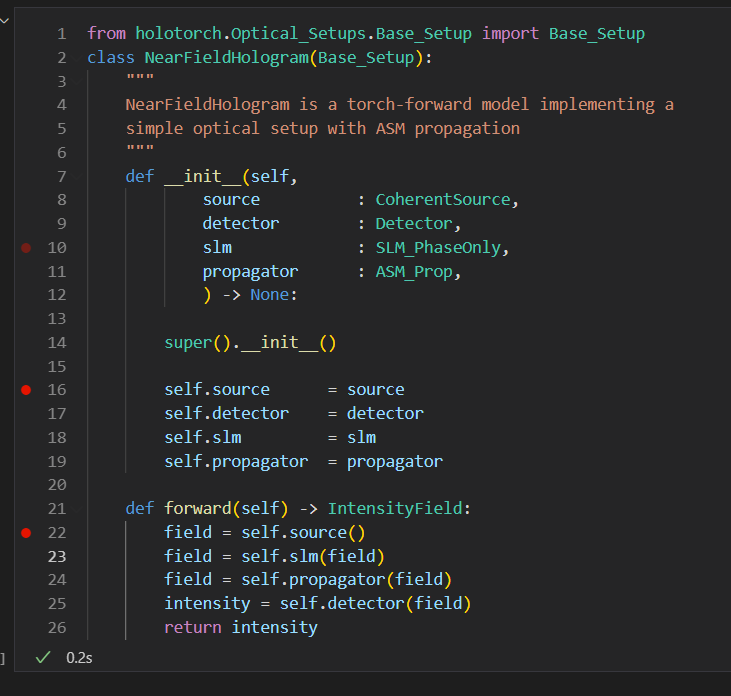
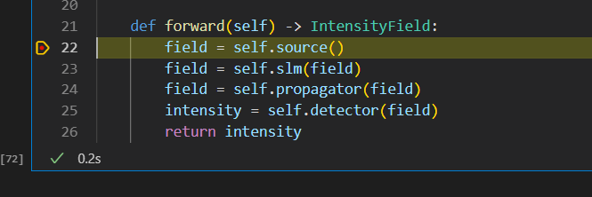
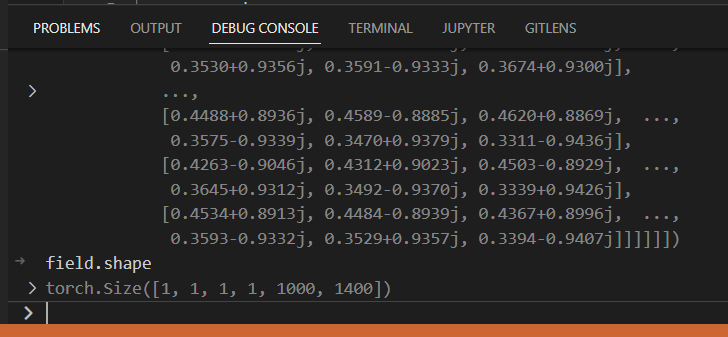
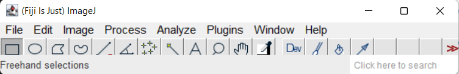
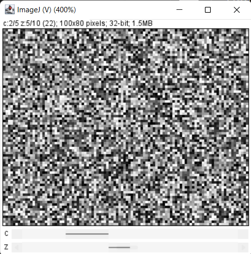

# Holotorch with Visual Studio Code

Holotorch is a big framework with many different modules, classes and functions. While you can run simple notebooks, scripts from a Notebook (or even a console), we highly recommend using an IDE to manage developing more complicated algorithms. 

We have used the following confiugration:
    1. Visual Studio Code with the Python/Jupyter extensions
    2. Jupytext extension to save/open .ipynb-notebooks 
    3. Use breakpoints to debug your model. The Debug console allows you to plot/visualize durig debugging

## Visual Studio Code
We recommend the **Visual Studio Code Insiders** version since there are some functionalities (like jupytext extension) which are not well supported on the release version.

Please install from here: https://code.visualstudio.com/insiders/

## Visual Studio Code Extensions
This is the basic configuration we use for development:
1. Python and Jupyter extensions
2. GitLens
3. Jupytext for Notebooks ( https://github.com/notebookPowerTools/vscode-jupytext/issues )

## Some notes on jupytext
We use jupytext because it allows us to collaborate/synch/share jupyternotebooks without having merge issue because the output of the notebook is saved.

So far jupytext has been the best solution for us, but it's not perfect as you can read in the "Issue" - list on GitHub.

In particular, there are problems with reopening a Notebook after it's closed or opening several notebooks at the same time. Some ugly behavior will behavior which can lead to your notebooks not being saved or actual .ipynb-notebooks being saved instead of .py files. 

Find more on this issue here: https://github.com/notebookPowerTools/vscode-jupytext/issues/9

## Debugging with Visual Studio Code and Jupyter Notebooks

The Jupyter debugger built into Visual Studio Code is probably one of the greatest reason to use this IDE. Read more on this here: https://code.visualstudio.com/docs/datascience/jupyter-notebooks#_debug-cell

## Navigating Holotorch with Short Codes and the IDE

You'll be most efficient implementing new algorithms when you use the full capacity of an IDE. Use shortcuts and Visual Studio Code's features to navigate between files, auto-rename variables throughout the whole workspaces. 

A few controls we found useful (on Windows):
1. Ctrl + p : Navigate to a specific file in your workspace
2. Ctrl + g : Navigate to a specific line your current file

Here are some pictures visualizing our workflow:





### ImageJ and Python

ImageJ ( https://imagej.net/software/fiji/ ) is a great Image Processing tool. One of our favorite features is how easy it is to visualize (and process) high-dimensional data.

Our "piji" module uses pyimagej ( https://github.com/imagej/pyimagej ) to load data (numpy/torch) directly into the ImageJ gui.

Here is a code-snippt explaining basic functionality:
```
import holotorch.utils.pjji as piji
piji.initialize_ij()
piji.show(torch.rand(10,5,80,100))
```

The Piji GUI should open



and a 4D-image should be displayed like this:




### Navigate a notebook with Table-of-content feature
Juputer Notebooks in Visual Studio code have an outline which is defined by the "Markdown" blocks that you define in your notebook.
If you use them efficent, you'll be much quicker navigating to long and lengthy notebooks.

Find more information here: https://code.visualstudio.com/docs/datascience/jupyter-notebooks#_table-of-contents
